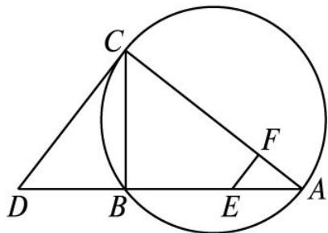

<!-- question-source:start -->
22．(2013 课标全国Ⅱ，理 22)(本小题满分 10 分)选修 4—1：几何证明选讲

如图，CD 为 $\triangle ABC$ 外接圆的切线，AB 的延长线交直线 CD 于点 D，E，F 分别为弦 AB 与弦 AC 上的点，且 $BC \cdot AE = DC \cdot AF$ ，B，E，F，C 四点共圆.

(1)证明: $CA$ 是 $\triangle ABC$ 外接圆的直径;

(2)若 $DB = BE = EA$ ，求过 $B$ ， $E$ ， $F$ ， $C$ 四点的圆的面积与 $\triangle ABC$ 外接圆面积的比值.

<!-- question-source:end -->

![[高中/真题/按年份分类/2013/2013年理科数学海南省高考真题含答案/解答题/题目/answers/Q00023329A1.md]]
