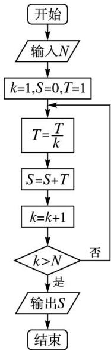

<!-- question-source:start -->
5. (2013 课标全国 II，理 5) 已知 $(1 + ax)(1 + x)^{5}$ 的展开式中 $x^{2}$ 的系数为 5，则 $a = (\quad)$ .

A. -4 B. -3 C. -2 D. -1

<!-- question-source:end -->

![[高中/真题/按年份分类/2013/2013年理科数学海南省高考真题含答案/选择题/题目/answers/Q00023312A1.md]]
