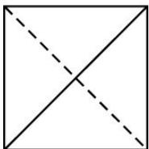
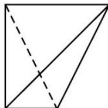
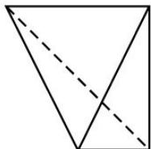
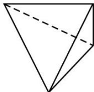

<!-- question-source:start -->
7. (2013 课标全国 II, 理 7)一个四面体的顶点在空间直角坐标系 $O - xyz$ 中的坐标分别是 $(1,0,1)$ , $(1,1,0)$ , $(0,1,1)$ , $(0,0,0)$ , 画该四面体三视图中的正视图时, 以 $zOx$ 平面为投影面, 则得到的正视图可以为( ).

A

B

C

D
<!-- question-source:end -->

![[高中/真题/按年份分类/2013/2013年理科数学海南省高考真题含答案/选择题/题目/answers/Q00023314A1.md]]
