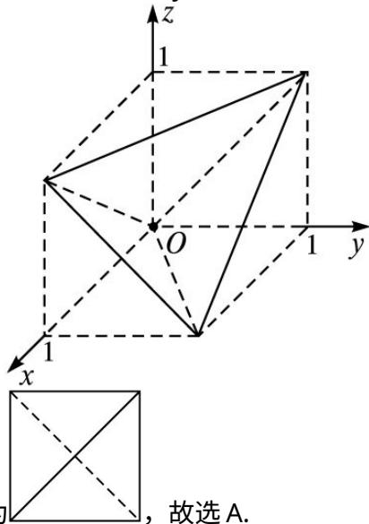

> [!faq]- 2013年理科数学海南省高考真题含答案解析
>
> > [!success]- **【答案】** A
>
> > [!note]- **【分析】**
> > 本题未单列分析。
>
> > [!note]- **【解析】**
> > 如图所示，该四面体在空间直角坐标系 O-xyz 的图像为下图：
> >
> > 
> >
> > 则它在平面 $zOx$ 上的投影即正视图为，故选A.
> > 8.
