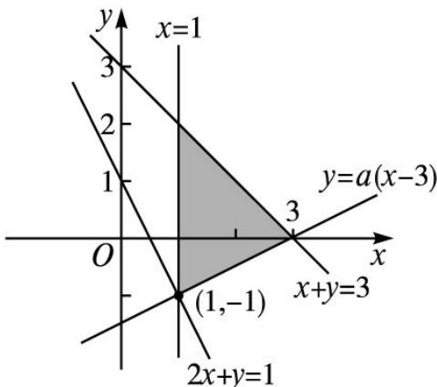

> [!faq]- 2013年理科数学海南省高考真题含答案解析
>
> > [!success]- **【答案】** B
>
> > [!note]- **【分析】**
> > 本题未单列分析。
>
> > [!note]- **【解析】**
> > 由题意作出 $\left\{ \begin{array}{l}x\geq 1,\\ x + y\leq 3 \end{array} \right.$ 所表示的区域如图阴影部分所示，
> >
> > 
> >
> > 作直线 $2x + y = 1$ ，因为直线 $2x + y = 1$ 与直线 x = 1 的交点坐标为 $(1, -1)$ ，结合题意知直线 $y = a(x - 3)$ 过点 $(1, -1)$ ，代入得 $a = \frac{1}{2}$ ，所以 $a = \frac{1}{2}$ .
