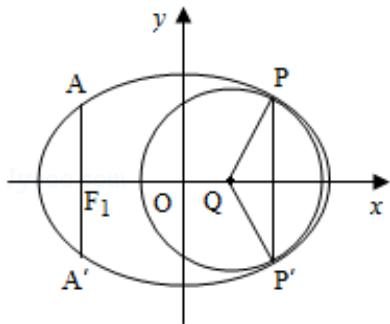

<!-- question-source:start -->
16. (2013·重庆) 如图, 椭圆的中心为原点 O, 长轴在 x 轴上, 离心率 $e = \frac{\sqrt{2}}{2}$ , 过左焦点 $F_1$ 作 x 轴的垂线交椭圆于 A、A'两点, $|AA'| = 4$ .

（Ⅰ）求该椭圆的标准方程；

（Ⅱ）取平行于 y 轴的直线与椭圆相交于不同的两点 P、P'，过 P、P' 作圆心为 Q 的圆，使椭圆上的其余点均在圆 Q 外．求 $\triangle PP'Q$ 的面积 S 的最大值，并写出对应的圆 Q 的标准方程.

<!-- question-source:end -->

![[高中/真题/按年份分类/2013/2013年重庆市高考数学试卷_文科_含答案/解答题/题目/answers/Q00022878A1.md]]
