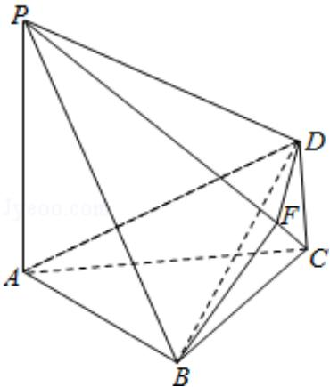

<!-- question-source:start -->
20. （12分）（2013·重庆）如图，四棱锥P-ABCD中，PA⊥底面ABCD， $\mathrm{PA} = 2\sqrt{3}$ ， $\mathrm{BC} = \mathrm{CD} = 2$ ， $\angle ACB = \angle ACD = \frac{\pi}{3}$ .

（Ⅰ）求证：BD⊥平面 PAC；

（II）若侧棱PC上的点F满足 $\mathrm{PF} = 7\mathrm{FC}$ ，求三棱锥P-BDF的体积.

<!-- question-source:end -->

![[高中/真题/按年份分类/2013/2013年重庆市高考数学试卷_文科_含答案/解答题/题目/answers/Q00022882A1.md]]
