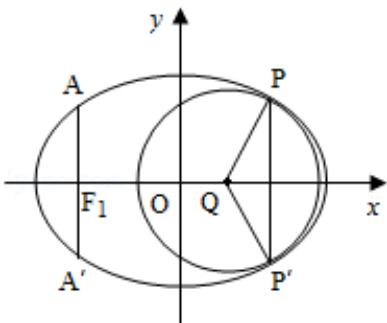

> [!faq]- 2013年重庆市高考数学试卷(文科)含答案解析
>
> > [!success]- **【答案】** 为： $[0, \frac{\pi}{6}] \cup [\frac{5\pi}{6}, \pi]$ . 点评：本题主要考查了一元二次不等式的解法、二次函数的恒成立问题，属于中档题. ## 三．解答题：本大题共6小题，共75分．
>
> > [!note]- **【分析】**
> > 由题意可得， $\triangle = 64\sin^2\alpha - 32\cos 2\alpha \leq 0$ 即 $2\sin^2\alpha - (1 - 2\sin^2\alpha) \leq 0$ ，解不等式结合 $0 \leq \alpha \leq \pi$ 可求 $\alpha$ 的取值范围.
>
> > [!note]- **【解析】**
> > 分析：由题意可得， $\triangle = 64\sin^2\alpha - 32\cos 2\alpha \leq 0$ 即 $2\sin^2\alpha - (1 - 2\sin^2\alpha) \leq 0$ ，解不等式结合 $0 \leq \alpha \leq \pi$ 可求 $\alpha$ 的取值范围.
> >
> > 解答：解：由题意可得， $\triangle = 64\sin^2\alpha - 32\cos 2\alpha \leq 0$
> >
> > 得 $2\sin^2\alpha - (1 - 2\sin^2\alpha) \leqslant 0$ $\therefore \sin^2\alpha \leqslant \frac{1}{4},$ $-\frac{1}{2} \leqslant \sin \alpha \leqslant \frac{1}{2},$ $\because 0 \leqslant \alpha \leqslant \pi$ $\therefore \alpha \in [0, \frac{\pi}{6}] \cup [\frac{5\pi}{6}, \pi].$
> >
> > 故
> > 答案为： $[0, \frac{\pi}{6}] \cup [\frac{5\pi}{6}, \pi]$ .
> >
> > 点评：本题主要考查了一元二次不等式的解法、二次函数的恒成立问题，属于中档题.
> >
> > ## 三．解答题：本大题共6小题，共75分．
> > 解答应写出文字说明、证明过程或演算步骤.
> >
> > 16 (2013·重庆) 如图, 椭圆的中心为原点 O, 长轴在 x 轴上, 离心率 $e=\frac{\sqrt{2}}{2}$ , 过左焦点 $F_{1}$ 作 x 轴的垂线交椭圆于 A、A'两点, $|AA'|=4$ .
> >
> > （Ⅰ）求该椭圆的标准方程；
> >
> > （Ⅱ）取平行于 y 轴的直线与椭圆相交于不同的两点 P、P'，过 P、P' 作圆心为 Q 的圆，使椭圆上的其余点均在圆 Q 外．求 $\triangle PP'Q$ 的面积 S 的最大值，并写出对应的圆 Q 的标准方程.
> >
> > 
> >
> > 考点：直线与圆锥曲线的关系；椭圆的标准方程.
> >
> > 专题：综合题；圆锥曲线的定义、性质与方程.
> >
> > 分析：
> >
> > （Ⅰ）设椭圆方程为 $\frac{x^{2}}{a^{2}}+\frac{y^{2}}{b^{2}}=1\quad(a>b>0)$ ，将左焦点横坐标代入椭圆方程可得 $y=\pm\frac{b^{2}}{a}$ ，则 $\frac{b^{2}}{a}=2①$ ，又 $\frac{c}{a}=\frac{\sqrt{2}}{2}②$ ， $a^{2}=b^{2}+c^{2}③$ ，联立①②③可求得a，b；
> >
> > （Ⅱ）设 $Q(t,0)(t > 0)$ ，圆的半径为 $\mathbf{r}$ ，直线PP方程为： $\mathrm{x = m(m > t)}$ ，则圆Q的方程为： $(x - t)^2 +y^2 = r^2$ ，联立圆与椭圆方程消掉y得x的二次方程，则 $\triangle = 0①$ ，易求P点坐标，代入圆的方程得等式②，由①②消掉r得 $\mathrm{m} = 2\mathrm{t}$ ，则 $S_{\triangle PP^{\prime},Q} = \frac{1}{2} |PP^{\prime}|(m - t)$ ，变为关于t的函数，利用基本不等式可求其最大值及此时t值，由对称性可得圆心Q在y轴左侧的情况；
> >
> > 解答：解：（I）设椭圆方程为 $\frac{x^2}{a^2} +\frac{y^2}{b^2} = 1(a > b > 0)$
> >
> > 左焦点 $\mathrm{F}_1$ （-c，0），将横坐标-c代入椭圆方程，得 $y = \pm \frac{b^2}{a}$
> >
> > 所以 $\frac{b^2}{a} = 2①$ ， $\frac{c}{a} = \frac{\sqrt{2}}{2} ②$ ， $a^2 = b^2 + c^2 ③$ ，联立 $①②③$ 解得 $a = 4$ ， $b = 2\sqrt{2}$
> >
> > 所以椭圆方程为： $\frac{x^2}{16} +\frac{y^2}{8} = 1$
> >
> > （Ⅱ）设 Q(t, 0) （t>0），圆的半径为 r，直线 PP' 方程为：x=m (m>t)，则圆 Q 的方程为： $(x-t)^{2}+y^{2}=r^{2}$ ，
> >
> > 由 $\left\{ \begin{array}{l} (x - t)^2 + y^2 = r^2 \\ \frac{x^2}{16} + \frac{y^2}{8} = 1 \end{array} \right.$ 得 $x^2 - 4tx + 2t^2 + 16 - 2r^2 = 0$
> >
> > 由 $\triangle = 0$ ，即 $16\mathrm{t}^2 -4(2\mathrm{t}^2 +16 - 2\mathrm{r}^2) = 0$ ，得 $\mathbf{t}^2 +\mathbf{r}^2 = 8$ ，①
> >
> > 把 $x = m$ 代入 $\frac{x^2}{16} +\frac{y^2}{8} = 1$ ，得 $y^{2} = 8(1 - \frac{m^{2}}{16}) = 8 - \frac{m^{2}}{2},$
> >
> > 所以点 P 坐标为 $(m, \sqrt{8 - \frac{m^{2}}{2}})$ ，代入 $(x - t)^{2} + y^{2} = r^{2}$ ，得 $(m - t)^{2} + 8 - \frac{m^{2}}{2} = r^{2}$ ，②
> > 由①②消掉 $r^{2}$ 得 $4t^{2}-4mt+m^{2}=0$ ，即 m=2t，
> >
> > $S_{\triangle PP', Q} = \frac{1}{2} |PP' | (m - t) = \sqrt{8 - \frac{m^2}{2}} \times (m - t) = \sqrt{8 - 2t^2} \times t = \sqrt{2(4 - t^2)t^2}$ $\leq \sqrt{2} \times \frac{(4 - t^2) + t^2}{2} = 2\sqrt{2},$
> >
> > 当且仅当 $4 - t^{2} = t^{2}$ 即 $t = \sqrt{2}$ 时取等号，
> >
> > 此时 $t+r=\sqrt{2}+\sqrt{6}<4$ ，椭圆上除 P、P' 外的点在圆 Q 外，
> >
> > 所以 $\triangle PP'Q$ 的面积 $S$ 的最大值为 $2\sqrt{2}$ ，圆 $Q$ 的标准方程为： $(x - \sqrt{2})^2 + y^2 = 6$ .
> >
> > 当圆心 Q、直线 PP' 在 y 轴左侧时，由对称性可得圆 Q 的方程为 $(x+\sqrt{2})^{2}+y^{2}=6$ ， $\triangle PP'Q$ 的面积 S 的最大值仍为为 $2\sqrt{2}$ .
> >
> > 点评：本题考查圆、椭圆的标准方程，考查椭圆的几何性质，考查方程组的解法，考查学生的计算能力，难度较大.
