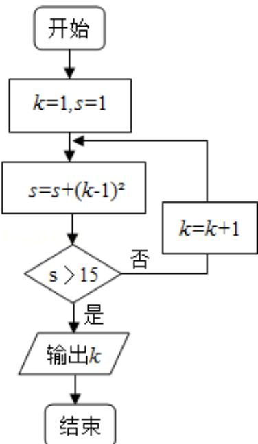

<!-- question-source:start -->
5. （5分）（2013·重庆）执行如图所示的程序框图，则输出的 k 的值是（）

A 3 B 4 C 5 D 6
. . .
<!-- question-source:end -->

![[高中/真题/按年份分类/2013/2013年重庆市高考数学试卷_文科_含答案/选择题/题目/answers/Q00022867A1.md]]
