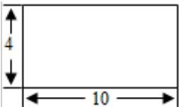
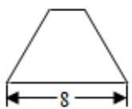

<!-- question-source:start -->
8. （5 分）（2013·重庆）某几何体的三视图如图所示，则该几何体的表面积为（）

  
正（主）视图

<table><tr><td>3</td><td></td></tr><tr><td>2</td><td></td></tr><tr><td>3</td><td></td></tr></table>

侧（左）视图  
俯视图

A 180 B 200 C 220 D 240
<!-- question-source:end -->

![[高中/真题/按年份分类/2013/2013年重庆市高考数学试卷_文科_含答案/选择题/题目/answers/Q00022870A1.md]]
