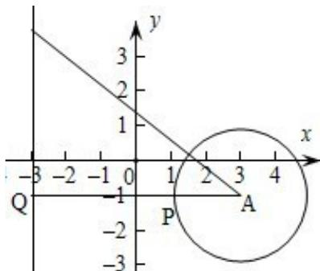

> [!faq]- 2013年重庆市高考数学试卷(文科)含答案解析
>
> > [!success]- **【答案】** 详见解析
>
> > [!note]- **【分析】**
> > 根据题意画出相应的图形, 过圆心 A 作 AQ⊥直线 x = -3, 与圆交于点 P, 此时 |PQ| 最小, 由圆的方程找出圆心 A 坐标与半径 r, 求出 |AQ| 的长, 由 |AQ| - r 即可求出 |PQ| 的最小值.
>
> > [!note]- **【解析】**
> > 解：过圆心A作AQ⊥直线 $x = -3$ ，与圆交于点P，此时|PQ|最小，
> >
> > 由圆的方程得到 A（3，-1），半径 r=2，
> >
> > 则 $|PQ|=|AQ|-r=6-2=4$ .
> >
> > 故选B
> >
> > 
> >
> > 点评：此题考查了直线与圆的位置关系，利用了数形结合的数学思想，灵活运用数形结合思想是解本题的关键。
