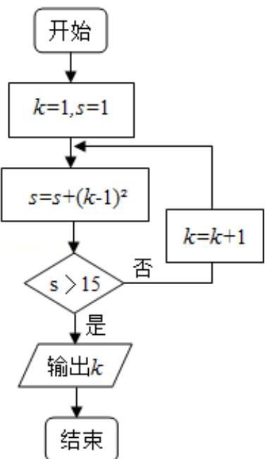

> [!faq]- 2013年重庆市高考数学试卷(文科)含答案解析
>
> > [!success]- **【答案】** 详见解析
>
> > [!note]- **【分析】**
> > 根据所给数值判定是否满足判断框中的条件，然后执行循环语句，一旦满足条件就退出循环，输出结果.
>
> > [!note]- **【解析】**
> > 分析：根据所给数值判定是否满足判断框中的条件，然后执行循环语句，一旦满足条件就退出循环，输出结果.
> >
> > 解答：解： $s=1+(1-1)^{2}=1$ ，不满足判断框中的条件，k=2， $s=1+(2-1)^{2}=2$ ，不满足判断框中的条件，k=3， $s=2+(3-1)^{2}=6$ ，不满足判断框中的条件，k=4， $s=6+(4-1)^{2}=15$ ，不满足判断框中的条件，k=5， $s=15+(5-1)^{2}=31$ ，满足判断框中的条件，退出循环，输出的结果为 k=5 故选 C.
> >
> > 
> >
> > 点评：本题给出程序框图，要我们求出最后输出值，着重考查了算法语句的理解和循环结构等知识，属于基础题.
