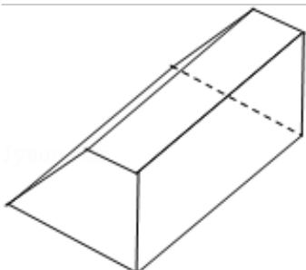

> [!faq]- 2013年重庆市高考数学试卷(文科)含答案解析
>
> > [!success]- **【答案】** 详见解析
>
> > [!note]- **【分析】**
> > 由三视图可知：该几何体是一个横放的直四棱柱，高为10；其底面是一个等腰梯形，上下边分别为2，8，高为4；据此可求出该几何体的表面积.
>
> > [!note]- **【解析】**
> > 分析：由三视图可知：该几何体是一个横放的直四棱柱，高为10；其底面是一个等腰梯形，上下边分别为2，8，高为4；据此可求出该几何体的表面积.
> >
> > 解答：解：由三视图可知：该几何体是一个横放的直四棱柱，高为10；其底面是一个等腰梯形，上下边分别为2，8，高为4. $\therefore S_{\text{表面积}} = 2 \times \frac{1}{2} \times (2 + 8) \times 4 + 2 \times 5 \times 10 + 2 \times 10 + 8 \times 10 = 240.$ 故选D.
> >
> > 
> >
> > 点评：本题考查由三视图还原直观图，由三视图求面积、体积，由三视图正确恢复原几何体是解决问题的关键.
