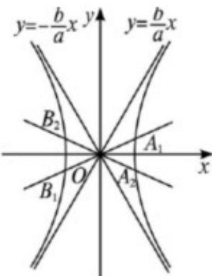

> [!faq]- 2013年重庆市高考数学试卷(文科)含答案解析
>
> > [!success]- **【答案】** 填写在答题卡相应位置上.
>
> > [!note]- **【分析】**
> > 不妨令双曲线的方程为 $\frac{x^{2}}{a^{2}}-\frac{y^{2}}{b^{2}}=1\quad(a>0,\quad b>0)$ ，由 $|A_{1}B_{1}|=|A_{2}B_{2}|$ 及双曲线的对称性知 $A_{1},A_{2},B_{1},B_{2}$ 关于x轴对称，由满足条件的直线只有一对，得 $\frac{\sqrt{3}}{3}<\frac{b}{a}\leqslant\sqrt{3}$
>
> > [!note]- **【解析】**
> > 分析：
> > 不妨令双曲线的方程为 $\frac{x^{2}}{a^{2}}-\frac{y^{2}}{b^{2}}=1\quad(a>0,\quad b>0)$ ，由 $|A_{1}B_{1}|=|A_{2}B_{2}|$ 及双曲线的对称性知 $A_{1},A_{2},B_{1},B_{2}$ 关于x轴对称，由满足条件的直线只有一对，得 $\frac{\sqrt{3}}{3}<\frac{b}{a}\leqslant\sqrt{3}$
> >
> > 由此能求出双曲线的离心率的范围.
> >
> > 解答：
> >
> > 解：不妨令双曲线的方程为 $\frac{x^2}{a^2} -\frac{y^2}{b^2} = 1(a > 0,b > 0)$
> >
> > 由 $|\mathrm{A}_1\mathrm{B}_1| = |\mathrm{A}_2\mathrm{B}_2|$ 及双曲线的对称性知 $\mathrm{A}_1$ ， $\mathrm{A}_2$ ， $\mathrm{B}_1$ ， $\mathrm{B}_2$ 关于x轴对称，如图，又：满足条件的直线只有一对，
> >
> > 当直线与 x 轴夹角为 $30^{\circ}$ 时，双曲线的渐近线与 x 轴夹角大于 $30^{\circ}$ ，
> >
> > 双曲线与直线才能有交点 $A_{1}$ ， $A_{2}$ ， $B_{1}$ ， $B_{2}$ ，
> >
> > 若双曲线的渐近线与 x 轴夹角等于 $30^{\circ}$ ，则无交点，
> >
> > 则不可能存在 $|A_{1}B_{1}|=|A_{2}B_{2}|$ ,
> >
> > 当直线与 x 轴夹角为 $60^{\circ}$ 时，双曲线渐近线与 x 轴夹角小于 $60^{\circ}$ ，双曲线与直线有一对交点 $A_{1}$ ， $A_{2}$ ， $B_{1}$ ， $B_{2}$ ，
> >
> > 若双曲线的渐近线与 x 轴夹角等于 $60^{\circ}$ ，也满足题中有一对直线，
> >
> > 但是如果大于 $60^{\circ}$ ，则有两对直线．不符合题意，
> >
> > $\therefore \tan 30^{\circ} <   \frac{b}{a}\leqslant \tan 60^{\circ}$ ，即 $\frac{\sqrt{3}}{3} <  \frac{b}{a}\leqslant \sqrt{3},$
> >
> > $$
> > \therefore \frac {1}{3} <   \frac {\mathrm{b} ^ {2}}{\mathrm{a} ^ {2}} \leqslant 3,
> > $$
> >
> > $$
> > \because b ^ {2} = c ^ {2} - a ^ {2}, \therefore \frac {1}{3} <   \frac {c ^ {2} - a ^ {2}}{a ^ {2}} \leqslant 3, \therefore \frac {4}{3} <   e ^ {2} \leqslant 4,
> > $$
> >
> > $$
> > \therefore \frac {2 \sqrt {3}}{3} <   e \leqslant 2,
> > $$
> >
> > ∴双曲线的离心率的范围是 $\left(\frac{2\sqrt{3}}{3},2\right]$ .
> >
> > 故选：A.
> >
> > 
> >
> > 点评：本题考查双曲线的性质及其应用，解题时要注意挖掘隐含条件.
> >
> > ## 二. 填空题: 本大题共 5 小题, 考生作答 5 小题, 每小题 5 分, 共 25 分. 把
> > 答案填写在答题卡相应位置上.
