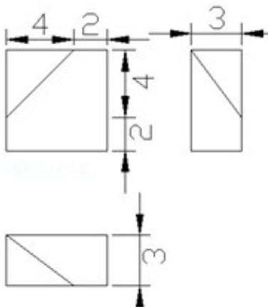
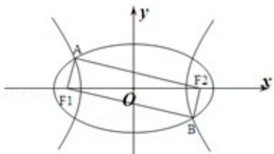

# 2013 年浙江省高考数学试卷（文科）

##
一、选择题：本大题共10小题，每小题5分，共50分.在每小题给出的四个选项中，只有一项是符合题目要求的.

1. （5分）（2013·浙江）设集合 $S = \{x | x > -2\}$ ， $T = \{x | -4 \leq x \leq 1\}$ ，则 $S \cap T =$ （ ）
A. $[-4, +\infty)$ B. $(-2, +\infty)$ C. $[-4, 1]$ D. $(-2, 1]$

2. (5分) (2013·浙江) 已知 i 是虚数单位，则 $(2+i)$ $(3+i)=(\quad)$ A. 5 - 5i B. 7 - 5i C. $5 + 5i$ D. $7 + 5i$

3. （5分）（2013·浙江）若 $\alpha\in R$ ，则 “ $\alpha=0$ ” 是 “ $\sin\alpha<\cos\alpha$ ” 的（）
A．充分不必要条件
B．必要不充分条件
C．充分必要条件
D．既不充分也不必要条件

4. （5分）（2013·浙江）设 m、n 是两条不同的直线， $\alpha$ 、 $\beta$ 是两个不同的平面，（）
A. 若 $m \parallel \alpha$ ， $n \parallel \alpha$ ，则 $m \parallel n$ B. 若 $m \parallel \alpha$ ， $m \parallel \beta$ ，则 $\alpha \parallel \beta$ C. 若 $m \parallel n$ ， $m \perp \alpha$ ，则 $n \perp \alpha D$ . 若 $m \parallel \alpha$ ， $\alpha \perp \beta$ ，则 $m \perp \beta$

5. （5分）（2013·浙江）已知某几何体的三视图（单位：cm）如图所示，则该几何体的体积是（）

A. $108\mathrm{cm}^3$ B. $100\mathrm{cm}^3$ C. $92\mathrm{cm}^3$ D. $84\mathrm{cm}^3$

6. （5分）（2013·浙江）函数 $f(x) = \sin x \cos x + \frac{\sqrt{3}}{2} \cos 2x$ 的最小正周期和振幅分别是（）
A. π, 1    B. π, 2    C. 2π, 1    D. 2π, 2

7. （5分）（2013·浙江）已知a、b、 $c \in R$ ，函数f（x）=ax²+bx+c。若f（0）=f（4）>f（1），则（）
A. a>0, 4a+b=0    B. a<0, 4a+b=0    C. a>0, 2a+b=0    D. a<0, 2a+b=0

8.（5分）(2013·浙江)已知函数 $y = f(x)$ 的图象是下列四个图象之一，且其导函数 $y = f'(x)$ 的图象如图所示，则该函数的图象是（）

The Ground Truth image displays a single, solid horizontal line, which is a stylistic or background element (like a ruled paper line or separator), not a placeholder for text. According to Rule 2, such stylistic/background lines must be ignored by the OCR result. The OCR content provided is "", which consists of no characters. This correctly represents the absence of any textual content in the GT and correctly matches the visual line as a stylistic element. Therefore, the OCR output should have been empty or omitted this line entirely.

A.

B.

C.

D.

9.（5分）(2013·浙江)如图 $\mathrm{F_1}$ 、 $\mathrm{F_2}$ 是椭圆 $C_1: \frac{x^2}{4} + y^2 = 1$ 与双曲线C2的公共焦点A、B分别是 $C_1$ 、 $C_2$ 在第
二、四象限的公共点，若四边形 $\mathrm{AF}_1\mathrm{BF}_2$ 为矩形，则 $C_2$ 的离心率是（）

A. $\sqrt{2}$ B. $\sqrt{3}$ C. $\frac{3}{2}$ D. $\frac{\sqrt{6}}{2}$

10. （5分）（2013·浙江）设 $a, b \in \mathbb{R}$ ，定义运算“ $\wedge$ ”和“ $\vee$ ”如下： $a \wedge b = \begin{cases} a, & a \leqslant b \\ b, & a > b \end{cases}$ $a \vee b = \begin{cases} b, & a \leqslant b \\ a, & a > b \end{cases}$

若正数 a、b、c、d 满足 $ab \geq 4$ ， $c + d \leq 4$ ，则（）
A. $a \wedge b \geq 2$ , $c \wedge d \leq 2$ B. $a \wedge b \geq 2$ , $c \vee d \geq 2$ C. $a \vee b \geq 2$ , $c \wedge d \leq 2$ D. $a \vee b \geq 2$ , $c \vee d \geq 2$

##

![[高中/真题/按年份分类/2013/2013年高考浙江文科数学试题及答案_精校版_/填空题/填空题.md]]
![[高中/真题/按年份分类/2013/2013年高考浙江文科数学试题及答案_精校版_/解答题/解答题.md]]
![[高中/真题/按年份分类/2013/2013年高考浙江文科数学试题及答案_精校版_/选择题/选择题.md]]
