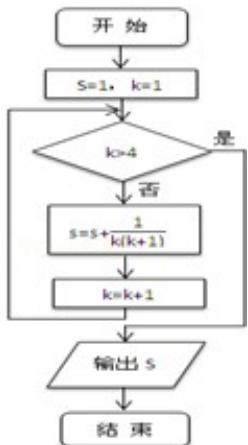

<!-- question-source:start -->
13. （4分）（2013·浙江）直线 $y = 2x + 3$ 被圆 $x^{2} + y^{2} - 6x - 8y = 0$ 所截得的弦长等于 \_\_\_\_.

<!-- question-source:end -->

![[高中/真题/按年份分类/2013/2013年高考浙江文科数学试题及答案_精校版_/填空题/题目/answers/Q00023626A1.md]]
