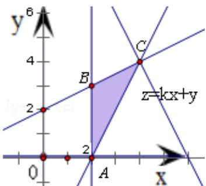

> [!faq]- 2013年高考浙江文科数学试题及答案(精校版)解析
>
> > [!success]- **【答案】** 。
>
> > [!note]- **【分析】**
> > 作出题中不等式组表示的平面区域，得如图的 $\triangle ABC$ 及其内部，再将目标函数 $z = kx + y$ 对应的直线进行平移。经讨论可得当当 $k < 0$ 时，找不出实数 $k$ 的值使 $z$ 的最大值为12；当 $k \geq 0$ 时，结合图形可得：当1经过点 $C$ 时， $z_{\max} = F(4, 4) = 4k + 4 = 12$ ，解得 $k = 2$ ，得到本题
>
> > [!note]- **【解析】**
> > 解：作出不等式组 $\left\{ \begin{array}{l} x \geqslant 2 \\ x - 2y + 4 \geqslant 0 \\ 2x - y - 4 \leqslant 0 \end{array} \right.$ 表示的平面区域，得到如图的△ABC及其内部，
> >
> > 
> >
> > 其中 A $(2, 0)$ ，B $(2, 3)$ ，C $(4, 4)$
> >
> > 设 $z=F(x,y)=kx+y$ ，将直线 l: $z=kx+y$ 进行平移，可得
> >
> > ① 当 k<0 时，直线 l 的斜率 - k>0，
> >
> > 由图形可得当1经过点B（2，3）或C（4，4）时，z可达最大值，
> >
> > 此时， $z_{\max}=F(2,3)=2k+3$ 或 $z_{\max}=F(4,4)=4k+4$
> >
> > 但由于 k<0，使得 $2k+3<12$ 且 $4k+4<12$ ，不能使 z 的最大值为 12，
> >
> > 故此种情况不符合题意；
> >
> > ② 当 $k \geq 0$ 时，直线 l 的斜率 $-k \leq 0$ ，
> >
> > 由图形可得当 l 经过点 C 时，目标函数 z 达到最大值
> >
> > 此时 $z_{\max}=F(4,4)=4k+4=12$ ，解之得 k=2，符合题意
> >
> > 综上所述，实数 $\mathbf{k}$ 的值为2
> >
> > 故
