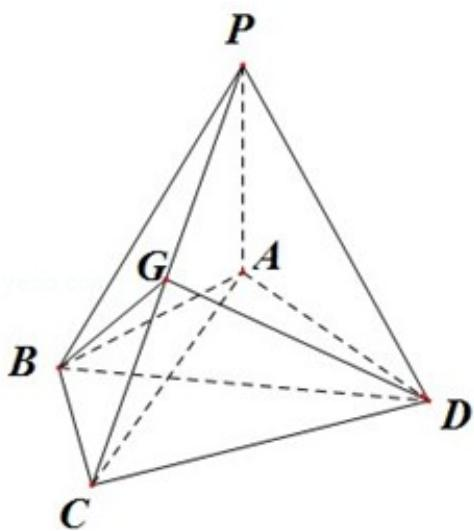

<!-- question-source:start -->
20. （15分）（2013·浙江）如图，在四棱锥P-ABCD中，PA⊥面ABCD， $AB=BC=2$ ， $AD=CD=\sqrt{7}$ ， $PA=\sqrt{3}$ ， $\angle ABC=120^{\circ}$ ，G为线段PC上的点.

（Ⅰ）证明：BD⊥面 PAC；

（Ⅱ）若 G 是 PC 的中点，求 DG 与 PAC 所成的角的正切值；

（III）若 G 满足 PC⊥面 BGD，求 $\frac{PG}{GC}$ 的值.

<!-- question-source:end -->

![[高中/真题/按年份分类/2013/2013年高考浙江文科数学试题及答案_精校版_/解答题/题目/answers/Q00023633A1.md]]
