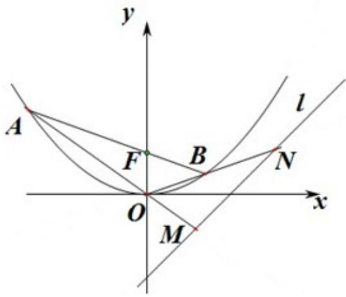

<!-- question-source:start -->
22. （14分）（2013·浙江）已知抛物线C的顶点为O（0，0），焦点F（0，1）

（Ⅰ）求抛物线 C 的方程；

（Ⅱ）过 F 作直线交抛物线于 A、B 两点．若直线 OA、OB 分别交直线 l：y=x-2 于 M、N 两点，求 |MN| 的最小值.

# 2013 年浙江省高考数学试卷（文科）

# 参考
<!-- question-source:end -->

![[高中/真题/按年份分类/2013/2013年高考浙江文科数学试题及答案_精校版_/解答题/题目/answers/Q00023635A1.md]]
