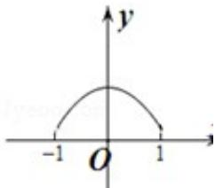

<!-- question-source:start -->
7. （5分）（2013·浙江）已知a、b、 $c \in R$ ，函数f（x）=ax²+bx+c。若f（0）=f（4）>f（1），则（）
A. a>0, 4a+b=0    B. a<0, 4a+b=0    C. a>0, 2a+b=0    D. a<0, 2a+b=0

<!-- question-source:end -->

![[高中/真题/按年份分类/2013/2013年高考浙江文科数学试题及答案_精校版_/选择题/题目/answers/Q00023620A1.md]]
