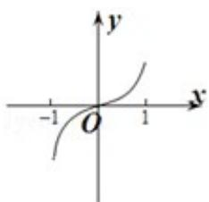
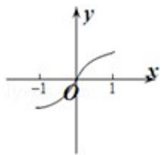
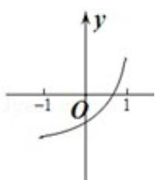
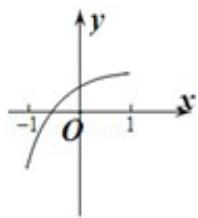

<!-- question-source:start -->
8.（5分）(2013·浙江)已知函数 $y = f(x)$ 的图象是下列四个图象之一，且其导函数 $y = f'(x)$ 的图象如图所示，则该函数的图象是（）

The Ground Truth image displays a single, solid horizontal line, which is a stylistic or background element (like a ruled paper line or separator), not a placeholder for text. According to Rule 2, such stylistic/background lines must be ignored by the OCR result. The OCR content provided is "", which consists of no characters. This correctly represents the absence of any textual content in the GT and correctly matches the visual line as a stylistic element. Therefore, the OCR output should have been empty or omitted this line entirely.

A.

B.

C.

D.

<!-- question-source:end -->

![[高中/真题/按年份分类/2013/2013年高考浙江文科数学试题及答案_精校版_/选择题/题目/answers/Q00023621A1.md]]
