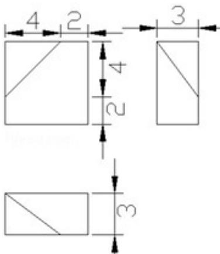

<!-- question-source:start -->
5. （5 分）（2013·浙江）已知某几何体的三视图（单位：cm）如图所示，则该几何体的体积是（）

A. $108\mathrm{cm}^3$ B. $100\mathrm{cm}^3$ C. $92\mathrm{cm}^3$ D. $84\mathrm{cm}^3$

考点：由三视图求面积、体积.

专题：空间位置关系与距离.
<!-- question-source:end -->

![[高中/真题/按年份分类/2013/2013年高考浙江文科数学试题及答案_精校版_/选择题/题目/answers/Q00031624A1.md]]
