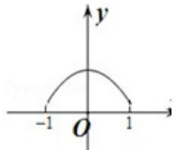
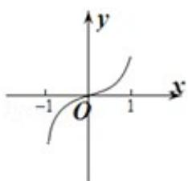
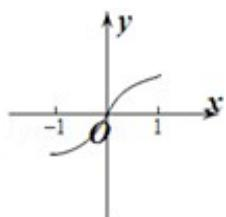
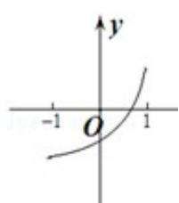
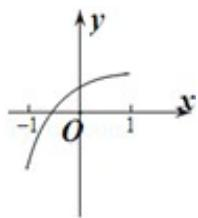

<!-- question-source:start -->
8. (5 分) (2013·浙江) 已知函数 $y = f(x)$ 的图象是下列四个图象之一, 且其导函数 $y = f'(x)$ 的图象如图所示, 则该函数的图象是 ( )

A.

B.

C.

D.

考点： 函数的图象.

专题：函数的性质及应用.
<!-- question-source:end -->

![[高中/真题/按年份分类/2013/2013年高考浙江文科数学试题及答案_精校版_/选择题/题目/answers/Q00031627A1.md]]
