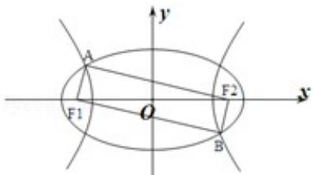

<!-- question-source:start -->
9. (5 分) (2013·浙江) 如图 $F_{1} 、 F_{2}$ 是椭圆 $C_{1}: \frac{x^{2}}{4} + y^{2} = 1$ 与双曲线 $C_{2}$ 的公共焦点 A、B 分别是 $C_{1} 、 C_{2}$ 在第
二、四象限的公共点, 若四边形 $AF_{1}BF_{2}$ 为矩形, 则 $C_{2}$ 的离心率是 ( )

A. $\sqrt{2}$ B. $\sqrt{3}$ C. $\frac{3}{2}$ D. $\frac{\sqrt{6}}{2}$

考点：椭圆的简单性质.

专题：计算题；圆锥曲线的定义、性质与方程.
<!-- question-source:end -->

![[高中/真题/按年份分类/2013/2013年高考浙江文科数学试题及答案_精校版_/选择题/题目/answers/Q00031628A1.md]]
