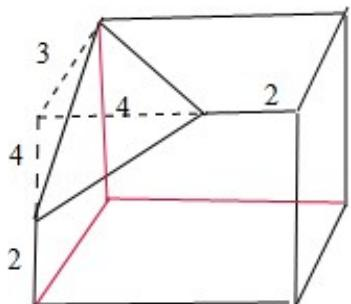

> [!faq]- 2013年高考浙江文科数学试题及答案(精校版)解析
>
> > [!success]- **【答案】** B
>
> > [!note]- **【分析】**
> > 由三视图可知: 该几何体是一个棱长分别为 6, 6, 3, 砍去一个三条侧棱长分别为 4, 4, 3 的一个三棱锥（长方体的一个角）．据此即可得出体积.
>
> > [!note]- **【解析】**
> > 解: 由三视图可知: 该几何体是一个棱长分别为 6, 6, 3, 砍去一个三条侧棱长分别为 4, 4, 3 的一个三棱锥（长方体的一个角）.
> >
> > ∴该几何体的体积 $V=6\times6\times3-\frac{1}{3}\times\frac{1}{2}\times4^{2}\times3=100$ .
> >
> > 故选B.
> >
> > 
> >
> > 点评：由三视图正确恢复原几何体是解题的关键.
