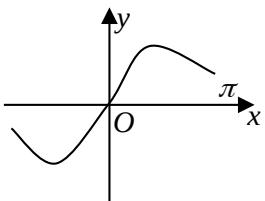
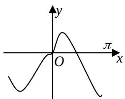
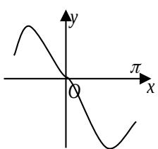
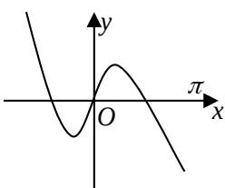
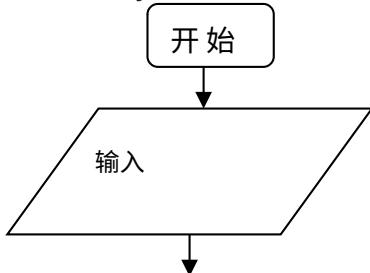

# 2013年普通高等学校招生全国统一考试（山东卷）

# 理科数学

1. 参考公式：如果事件 A、B 互斥，那么 $P(A+B)=P(A)+P(B)$ 如果事件 A、B 独立，那么 $P(AB)=P(A)\bullet P(B)$ 。

## 第1卷（共60分）

##
一、选择题：本大题共12小题。每小题5分共60分。在每小题给出的四个选项中，只有一项是符合题目要求的。

$$
\overline {{z}}
$$

$$
2 + i
$$

$$
5 + i
$$

$$
5 - i
$$

2、已知集合 $A = \{0,1,2\}$ ，则集合 $B = \{x - y | x \in A, y \in A\}$ 中元素的个数是
(A) 1 (B) 3 (C) 5 (D) 9

3、已知函数 $f(x)$ 为奇函数，且当 x > 0 时， $f(x) = x^{2} + \frac{1}{x}$ ，则 $f(-1) =$ (A)-2 (B)0 (C)1 (D)2

4、已知三棱柱 $ABC - A_{1}B_{1}C_{1}$ 的侧棱与底面垂直，体积为 $\frac{9}{4}$ ，底面是边长为 $\sqrt{3}$ 的正三角形，若 P 为底面 $A_{1}B_{1}C_{1}$ 的中心，则 PA 与平面 ABC 所成角的大小为
(A) $\frac{5\pi}{12}$ (B) $\frac{\pi}{3}$ (C) $\frac{\pi}{4}$ (D) $\frac{\pi}{6}$

5、将函数 $y = \sin (2x + \varphi)$ 的图象沿 $x$ 轴向左平移 $\frac{\pi}{8}$ 个单位后，得到一个偶函数的图象，则 $\varphi$ 的一个可能取值为
(A) $\frac{3\pi}{4}$ (B) $\frac{\pi}{4}$ (C) 0 (D) $-\frac{\pi}{4}$

6、在平面直角坐标系 $xOy$ 中， $M$ 为不等式组 $\left\{ \begin{array}{l} 2x - y - 2 \geq 0 \\ x + 2y - 1 \geq 0, \\ 3x + y - 8 \leq 0 \end{array} \right.$ 所表示的区域上一动点，则直线 $OM$ 的斜率的最小值为  
(A) 2 (B) 1 (C) $-\frac{1}{3}$ (D) $-\frac{1}{2}$

7、给定两个命题 $p, q$ . 若 $\neg p$ 是 $q$ 的必要不充分条件，则 $p$ 是 $\neg q$ 的
(A) 充分不必要条件 (B) 必要不充分条件 (C) 充要条件 (D) 既不充分也不必要条件

8、函数 $y = x\cos x + \sin x$ 的图象大致为

(A) (B) (C) (D)

9、过点(3,1)作圆 $(x-1)^{2}+y^{2}=1$ 的两条切线，切点分别为A,B，则直线AB的方程为
(A) $2x + y - 3 = 0$ (B) $2x - y - 3 = 0$ (C) $4x - y - 3 = 0$ (D) $4x + y - 3 = 0$

10、用 0, 1, …, 9 十个数字，可以组成有重复数字的三位数的个数为
(A) 243 (B) 252 (C) 261 (D) 279

11、抛物线 $C_1: y = \frac{1}{2p} x^2 (p > 0)$ 的焦点与双曲线 $C_2: \frac{x^2}{3} - y^2 = 1$ 的右焦点的连线交 $C_1$ 于第一象限的点 $M$ . 若 $C_1$ 在点 $M$ 处的切线平行于 $C_2$ 的一条渐近线，则 $p =$ (A) $\frac{\sqrt{3}}{16}$ (B) $\frac{\sqrt{3}}{8}$ (C) $\frac{2\sqrt{3}}{3}$ (D) $\frac{4\sqrt{3}}{3}$

12、设正实数 $x, y, z$ 满足 $x^2 - 3xy + 4y^2 - z = 0$ . 则当 $\frac{xy}{z}$ 取得最大值时， $\frac{2}{x} + \frac{1}{y} - \frac{2}{z}$ 的最大值为

$$
\begin{array}{c} \frac {9}{4} \end{array}
$$

## 第Ⅱ卷（共90分）

##

![[高中/真题/按年份分类/2013/2013年高考真题数学_理__山东卷__含解析版_/填空题/填空题.md]]
![[高中/真题/按年份分类/2013/2013年高考真题数学_理__山东卷__含解析版_/选择题/选择题.md]]
![[高中/真题/按年份分类/2013/2013年高考真题数学_理__山东卷__含解析版_/解答题/解答题.md]]
