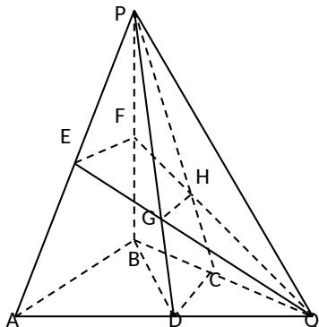

<!-- question-source:start -->
## 17、（本小题满分 12 分）

设 $\Delta ABC$ 的内角 A, B, C 所对的边分别为 a, b, c，且 $a + c = 6, b = 2, \cos B = \frac{7}{9}$ .

(Ⅰ) 求 a, c 的值;

(Ⅱ) 求 $\sin(A - B)$ 的值.

<!-- question-source:end -->

![[高中/真题/按年份分类/2013/2013年高考真题数学_理__山东卷__含解析版_/填空题/题目/answers/Q00028267A1.md]]
