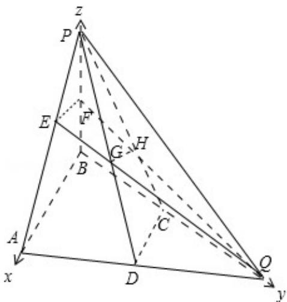

> [!faq]- 2013年高考真题数学【理】(山东卷)（含解析版）解析
>
> > [!success]- **【答案】** 详见解析
>
> > [!note]- **【分析】**
> > （1）由给出的 D, C, E, F 分别是 AQ, BQ, AP, BP 的中点，利用三角形中位线知识及平行公理得到 DC 平行于 EF，再利用线面平行的判定和性质得到 DC 平行于 GH，从而得到 AB|GH；
> > (2) 由题意可知 BA、BQ、BP 两两相互垂直，以 B 为坐标原点建立空间直角坐标系，设出 BA、BQ、BP 的长度，标出点的坐标，求出一些向量的坐标，利用二面角的两个面的法向量所成的角的余弦值求解二面角 D-GH-E 的余弦值.
>
> > [!note]- **【解析】**
> > （1）证明：如图，
> >
> > 
> >
> > ∵C，D为AQ，BQ的中点，∴CD∥AB，
> >
> > 又 E，F 分别 AP，BP 的中点，∴ EF∥AB，
> >
> > 则 EF∥CD．又 EF⊂平面 EFQ，∴CD∥平面 EFQ.
> >
> > 又 CD⊂平面 PCD，且平面 PCDn 平面 EFQ=GH，∴CD∥GH.
> >
> > 又 AB∥CD，∴AB∥GH；
> > (2) 由 $AQ = 2BD$ , D 为 AQ 的中点可得, 三角形 ABQ 为直角三角形,
> >
> > 以 B 为坐标原点，分别以 BA、BQ、BP 所在直线为 x、y、z 轴建立空间直角坐标系，设 AB = BP = BQ = 2，
> >
> > 则 D（1，1，0），C（0，1，0），E（1，0，1），F（0，0，1），
> >
> > 因为 H 为三角形 PBQ 的重心，所以 H（0， $\frac{2}{3}$ ， $\frac{2}{3}$ ）
> >
> > 则 $\overrightarrow{\mathrm{DC}} = (-1, 0, 0)$ ， $\overrightarrow{\mathrm{CH}} = (0, -\frac{1}{3}, \frac{2}{3})$
> >
> > $\overrightarrow{\mathrm{EF}} = (-1, 0, 0), \overrightarrow{\mathrm{FH}} = (0, \frac{2}{3}, -\frac{1}{3})$
> >
> > 设平面GCD的一个法向量为 $\vec{\mathfrak{m}} = (\mathbf{x}_1, \mathbf{y}_1, \mathbf{z}_1)$
> >
> > 由 $\left\{\begin{aligned}\overrightarrow{m}&\cdot\overrightarrow{DC}=0\\\overrightarrow{m}&\cdot\overrightarrow{CH}=0\end{aligned}\right.$ ，得 $\left\{\begin{aligned}-x_{1}&=0\\-\frac{1}{3}y_{1}&+\frac{2}{3}z_{1}&=0\end{aligned}\right.$ ，取 $z_{1}=1$ ，得 $y_{1}=2$ .
> >
> > 所以 $\vec{\pi} = (0, 1, 2)$ 。
> >
> > 设平面 EFG 的一个法向量为 $\vec{n}=(x_{2},y_{2},z_{2})$
> >
> > 由 $\left\{ \begin{array}{l} \overrightarrow{\mathrm{n}} \cdot \overrightarrow{\mathrm{EF}} = 0 \\ \overrightarrow{\mathrm{n}} \cdot \overrightarrow{\mathrm{FH}} = 0 \end{array} \right.$ ，得 $\left\{ \begin{array}{l} -x_2 = 0 \\ \frac{2}{3} y_2 - \frac{1}{3} z_2 = 0 \end{array} \right.$ ，取 $z_2 = 2$ ，得 $y_2 = 1$ 。
> >
> > 所以 $\vec{\mathbf{n}} = (0, 2, 1)$
> >
> > 所以 $\cos < \vec{m}, \vec{n} > = \frac{\vec{m} \cdot \vec{n}}{|\vec{m}| \cdot |\vec{n}|} = \frac{2 \times 1 + 1 \times 2}{\sqrt{5}\sqrt{5}} = \frac{4}{5}$ .
> >
> > 则二面角 D-GH-E 的余弦值等于 $-\frac{4}{5}$ .
> >
> > 点评：本题考查了直线与平面平行的性质，考查了二面角的平面角及其求法，考查了学生的空间想象能力和思维能力，考查了计算能力，解答此题的关键是正确求出H点的坐标，是中档题.
