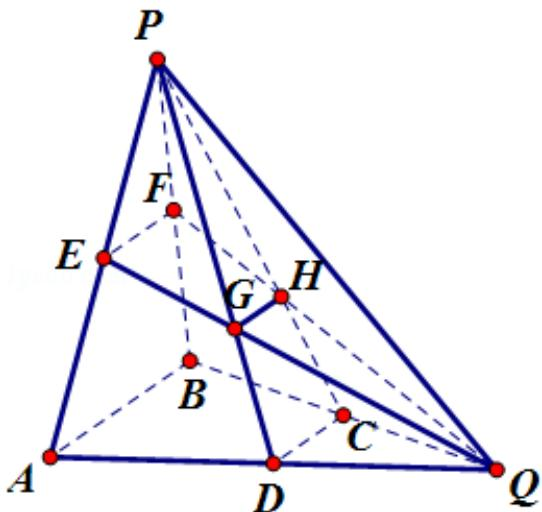

<!-- question-source:start -->
18. （12分）（2013·山东）如图所示，在三棱锥P-ABQ中，PB⊥平面ABQ，BA=BP=BQ，D，C，E，F分别是AQ，BQ，AP，BP的中点，AQ=2BD，PD与EQ交于点G，PC与FQ交于点H，连接GH.

(1) 求证: $AB \parallel GH$ ;

(2) 求二面角 D - GH - E 的余弦值.

考点：二面角的平面角及求法；直线与平面平行的性质.

专题：空间位置关系与距离；空间角.
<!-- question-source:end -->

![[高中/真题/按年份分类/2013/2013年高考真题数学_理__山东卷__含解析版_/解答题/题目/answers/Q00026295A1.md]]
