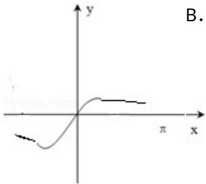
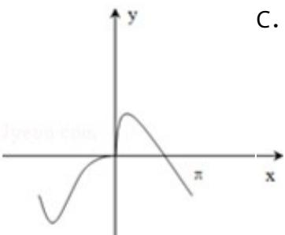
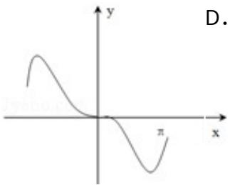
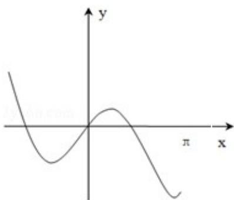

<!-- question-source:start -->
8. (5 分) (2013·山东) 函数 $y = x \cos x + \sin x$ 的图象大致为 ( )

A.  

考点： 函数的图象.

专题：函数的性质及应用.
<!-- question-source:end -->

![[高中/真题/按年份分类/2013/2013年高考真题数学_理__山东卷__含解析版_/选择题/题目/answers/Q00028261A1.md]]
