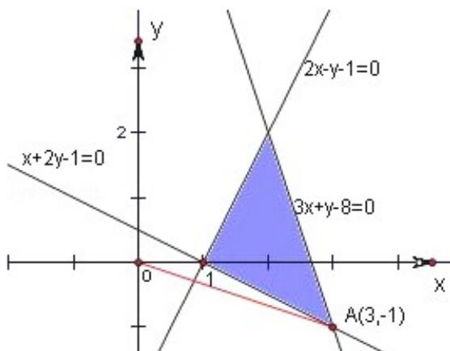

> [!faq]- 2013年高考真题数学【理】(山东卷)（含解析版）解析
>
> > [!success]- **【答案】** C
>
> > [!note]- **【分析】**
> > 本题属于线性规划中的延伸题，对于可行域不要求线性目标函数的最值，而是求可行域内的点与原点(0,0)构成的直线的斜率的最小值即可.
>
> > [!note]- **【解析】**
> > 分析：本题属于线性规划中的延伸题，对于可行域不要求线性目标函数的最值，而是求可行域内的点与原点(0,0)构成的直线的斜率的最小值即可.
> >
> > 解答：
> >
> > 解：不等式组 $\left\{\begin{aligned}&2x-y-2\geqslant0\\&x+2y-1\geqslant0\\&3x+y-8\leqslant0\end{aligned}\right.$ 表示的区域如图，
> >
> > $$
> > k = \frac {- 1}{3} = - \frac {1}{3}.
> > $$
> >
> > 故选 C.
> >
> > 
> >
> > 点评：本题利用直线斜率的几何意义，求可行域中的点与原点的斜率。本题主要考查了用平面区域二元一次不等式组，以及简单的转化思想和数形结合的思想，属中档题。
