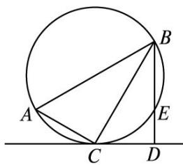

<!-- question-source:start -->
14. (2013 重庆, 理 14) 如图, 在 $\triangle ABC$ 中, $\angle C = 90^{\circ}$ , $\angle A = 60^{\circ}$ , $AB = 20$ , 过 $C$ 作 $\triangle ABC$ 的外接圆的切线 $CD$ , $BD \perp CD$ , $BD$ 与外接圆交于点 $E$ , 则 $DE$ 的长为 \_\_\_\_.

<!-- question-source:end -->

![[高中/真题/按年份分类/2013/2013年高考重庆理科数学试题及答案_精校版_/填空题/题目/answers/Q00022833A1.md]]
