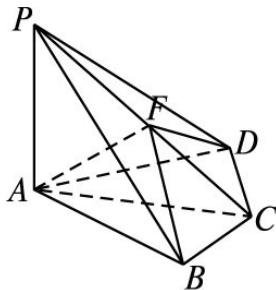

<!-- question-source:start -->
19. (2013 重庆, 理 19)(本小题满分 13 分,
(1) 小问 5 分,
(2) 小问 8 分.) 如图, 四棱锥 $P-ABCD$ 中, $PA \perp$ 底面

ABCD, $BC = CD = 2$ ， $AC = 4$ ， $\angle ACB = \angle ACD = \frac{\pi}{3}$ ， $F$ 为 $PC$ 的中点， $AF\bot PB$

(1)求 $PA$ 的长；

(2)求二面角 B-AF-D 的正弦值.

<!-- question-source:end -->

![[高中/真题/按年份分类/2013/2013年高考重庆理科数学试题及答案_精校版_/解答题/题目/answers/Q00029585A1.md]]
