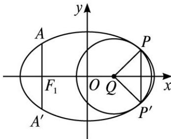

<!-- question-source:start -->
21.(2013 重庆, 理 21)(本小题满分 12 分,
(1) 小问 4 分,
(2) 小问 8 分.) 如图, 椭圆的中心为原点 O, 长轴在 x 轴上, 离心率 $e = \frac{\sqrt{2}}{2}$ , 过左焦点 $F_{1}$ 作 x 轴的垂线交椭圆于 A, $A'$ 两点, $|AA'| = 4$ .

(1)求该椭圆的标准方程;

(2)取垂直于 $x$ 轴的直线与椭圆相交于不同的两点 $P, P'$ , 过 $P, P'$ 作圆心为 $Q$ 的圆, 使椭圆上的其余点均在圆

Q 外．若 $PQ \perp P'Q$ ，求圆 Q 的标准方程.
<!-- question-source:end -->

![[高中/真题/按年份分类/2013/2013年高考重庆理科数学试题及答案_精校版_/解答题/题目/answers/Q00029587A1.md]]
