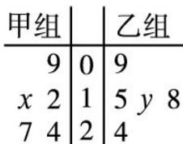

<!-- question-source:start -->
3. (2013 重庆，理 3) $\sqrt{(3-a)(a+6)(-6\leq a\leq3)}$ 的最大值为( )。
A. 9 B. $\frac{9}{2}$ C. 3 D. $\frac{3\sqrt{2}}{2}$

<!-- question-source:end -->

![[高中/真题/按年份分类/2013/2013年高考重庆理科数学试题及答案_精校版_/选择题/题目/answers/Q00022822A1.md]]
