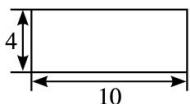

<!-- question-source:start -->
4. (2013 重庆, 理 4)以下茎叶图记录了甲、乙两组各五名学生在一次英语听力测试中的成绩(单位: 分). 已知甲组数据的中位数为 15, 乙组数据的平均数为 16.8, 则 $x$ , $y$ 的值分别为( ). A. 2,5 B. 5,5 C. 5,8 D. 8,8

<!-- question-source:end -->

![[高中/真题/按年份分类/2013/2013年高考重庆理科数学试题及答案_精校版_/选择题/题目/answers/Q00022823A1.md]]
