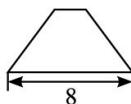
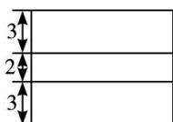

<!-- question-source:start -->
5. (2013 重庆, 理 5) 某几何体的三视图如图所示, 则该几何体的体积为( ). A. $\frac{560}{3}$ B. $\frac{580}{3}$ C. 200 D. 240

正(主)视图  
  
侧(左)视图  
俯视图
<!-- question-source:end -->

![[高中/真题/按年份分类/2013/2013年高考重庆理科数学试题及答案_精校版_/选择题/题目/answers/Q00022824A1.md]]
