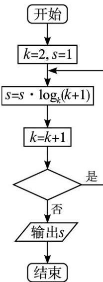

<!-- question-source:start -->
10. (2013 重庆，理 10) 在平面上， $AB_{1} \perp AB_{2}$ ， $|OB_{1}| = |OB_{2}| = 1$ ， $AP = AB_{1} + AB_{2}$ . 若 $|OP| < \frac{1}{2}$ ，则 $|OA|$ 的取值范围是（）.
A. $\left(0,\frac{\sqrt{5}}{2}\right)$ B. $\left(\frac{\sqrt{5}}{2},\frac{\sqrt{7}}{2}\right)$ C. $\left(\frac{\sqrt{5}}{2},\sqrt{2}\right)$ D. $\left(\frac{\sqrt{7}}{2},\sqrt{2}\right]$

##
二、填空题: 本大题共 6 小题, 考生作答 5 小题, 每小题 5 分, 共 25 分. 把
<!-- question-source:end -->

![[高中/真题/按年份分类/2013/2013年高考重庆理科数学试题及答案_精校版_/选择题/题目/answers/Q00028273A1.md]]
