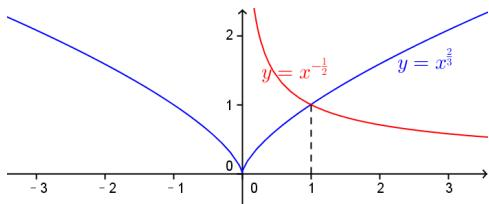

> [!faq]- 2014年上海高考数学真题（理科）试卷（word解析版）解析
>
> > [!success]- **【答案】** 详见解析
>
> > [!note]- **【分析】**
> > 本题未单列分析。
>
> > [!note]- **【解析】**
> > $f(x) <   0\Rightarrow x^{\frac{2}{3}} <   x^{-\frac{1}{2}}$ ，结合幂函数图像，如下图，可得 $x$ 的取值范围是(0,1)
> >
> > 
