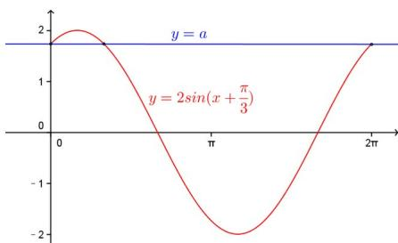

> [!faq]- 2014年上海高考数学真题（理科）试卷（word解析版）解析
>
> > [!success]- **【答案】** 详见解析
>
> > [!note]- **【分析】**
> > 本题未单列分析。
>
> > [!note]- **【解析】**
> > 化简得 $2\sin (x + \frac{\pi}{3}) = a$ ，根据下图，当且仅当 $a = \sqrt{3}$ 时，恰有三个交点，
> >
> > 即 $x_{1} + x_{2} + x_{3} = 0 + \frac{\pi}{3} +2\pi = \frac{7\pi}{3}$
> >
> > 
