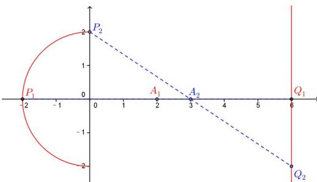

> [!faq]- 2014年上海高考数学真题（理科）试卷（word解析版）解析
>
> > [!success]- **【答案】** 详见解析
>
> > [!note]- **【分析】**
> > 本题未单列分析。
>
> > [!note]- **【解析】**
> > 根据题意， $A$ 是 $PQ$ 中点，即 $m = \frac{x_P + x_Q}{2} = \frac{x_P + 6}{2},\because -2\leq x_P\leq 0,\therefore m\in [2,3]$
> >
> > 
> >
> > ##
> > 二、选择题（本大题共有4题，满分20分）每题有且只有一个正确答案，考生应在答题纸的相应编号上，将代表答案的小方格涂黑，选对得5分，否则一律得零分.
