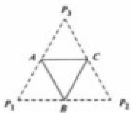

<!-- question-source:start -->
19、（本题满分 12 分）

底面边长为 2 的正三棱锥 P - ABC, 其表面学科网展开图是三角形 $p_{1}p_{2}p_{3}$ ，如图，求 $\triangle p_{1}p_{2}p_{3}$ 的各边长及此三棱锥的体积 V.

  
zxxk
<!-- question-source:end -->

![[高中/真题/按年份分类/2014/2014年上海高考数学真题_理科_试卷_word解析版_/解答题/题目/answers/Q00025947A1.md]]
