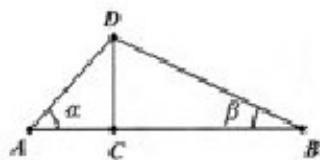

<!-- question-source:start -->
21.（本题满分14分）本题共有2个小题，第1小题满分6分，第2小题满分8分.
如图，某公司要在 A、B 两地连线上的定点 C 处建造广告牌 CD，其中 D 为顶端，AC 长 35 米，CB 长 80 米，设 A、B 在同一水平面上，从 A 和 B 看 D 的仰角分别为 $\alpha$ 和 $\beta$ .

(1) 设计中 CD 是铅垂方向, 若要求 $zxxk \alpha \geq 2\beta$ , 问 CD 的长至多为多少 (结果精确

到0.01米）？

(2) 施工完成后. $CD$ 与铅垂方向有偏差，现在学科网实测得 $\alpha = 38.12^{\circ}$ ， $\beta = 18.45^{\circ}$ 求 $CD$ 的长（结果精确到0.01米）？

22 (本题满分 16 分) 本题共 3 个小题, 第 1 小题满分 3 分, 第 2 小题满分 5 分, 第 3 小题满分 8 分.

在平面直角坐标系 $xoy$ 中，对于直线 $l: ax + by + c = 0$ 和点 $P_{i}(x_{1},y_{1}), P_{2}(x_{2},y_{2})$ ，记 $\eta = (ax_{1} + by_{1} + c)(ax_{2} + by_{2} + c)$ . 若 $\eta < 0$ ，则称点 $P_{1}, P_{2}$ 被直线 $l$ 分隔。若曲线C与直线 $l$ 没有公共点，且曲线C上存在点 $P_{1}, P_{2}$ 被直线 $l$ 分隔，则称直线 $l$ 为曲线C的一条分隔线. (1)求证：点 $A(1,2), B(-10)$ 被直线 $x + y - 1 = 0$ 分隔；

(2)若直线 $y = kx$ 是曲线 $x^{2} - 4y^{2} = 1$ 的分隔线，求实数 $k$ 的取值范围；

(3)动点 M 到点 $Q(0,2)$ 的距离与到 y 轴的距离之积为 1，设点 M 的轨迹为 E，求证：通过原点的直线中，有且仅有一条直线是 E 的分割线.
<!-- question-source:end -->

![[高中/真题/按年份分类/2014/2014年上海高考数学真题_理科_试卷_word解析版_/解答题/题目/answers/Q00025949A1.md]]
