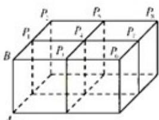

<!-- question-source:start -->
16. 如图, 四个棱长为 1 的正方体排成一个正四棱柱, AB 是一条侧棱, $P_{i}(i=1,2,\ldots)$ 是上底面上其余的八个点, 则 $\vec{AB} \cdot \vec{AP}_{i}(i=1,2\ldots)$ 的不同值的个数为 ( )

(A) 1 (B)2 (C)4 (D)8
<!-- question-source:end -->

![[高中/真题/按年份分类/2014/2014年上海高考数学真题_理科_试卷_word解析版_/选择题/题目/answers/Q00025944A1.md]]
