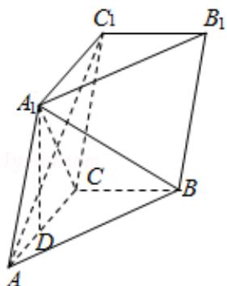

<!-- question-source:start -->
19. (12 分) 如图, 三棱柱 $ABC - A_{1}B_{1}C_{1}$ 中, 点 $A_{1}$ 在平面 $ABC$ 内的射影 $D$ 在 $AC$ 上, $\angle ACB = 90^{\circ}$ , $BC = 1$ , $AC = CC_{1} = 2$ .

(Ⅰ) 证明: $AC_{1} \perp A_{1}B$ ;

（II）设直线 $AA_{1}$ 与平面 $BCC_{1}B_{1}$ 的距离为 $\sqrt{3}$ ，求二面角 $A_{1}-AB-C$ 的大小.

<!-- question-source:end -->

![[高中/真题/按年份分类/2014/2014年全国统一高考数学试卷_文科__大纲版__含解析版_/解答题/题目/answers/Q00024744A1.md]]
