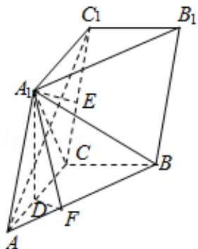

> [!faq]- 2014年全国统一高考数学试卷（文科）（大纲版）（含解析版）解析
>
> > [!success]- **【答案】** 详见解析
>
> > [!note]- **【分析】**
> > （Ⅰ）由已知数据结合线面垂直的判定和性质可得；
>
> > [!note]- **【解析】**
> > 解：（Ⅰ）∵ $A_{1}D$ ⊥平面ABC， $A_{1}DC$ 平面 $AA_{1}C_{1}C$ ，
> >
> > ∴平面 $AA_{1}C_{1}C \perp$ 平面 ABC，又 BC⊥AC
> >
> > ∴BC⊥平面 $AA_{1}C_{1}C$ ，连结 $A_{1}C$ ，
> >
> > 由侧面 $AA_{1}C_{1}C$ 为菱形可得 $AC_{1}\perp A_{1}C$ ,
> >
> > 又 $AC_{1} \perp BC, A_{1}C \cap BC = C,$
> >
> > $\therefore AC_{1} \perp$ 平面 $A_{1}BC$ , $AB_{1} \subset$ 平面 $A_{1}BC$ ,
> >
> > $\therefore AC_{1} \perp A_{1}B;$
> >
> > (II) $\because BC \perp$ 平面 $AA_{1}C_{1}C$ ， $BCC \subset$ 平面 $BCC_{1}B_{1}$ ，
> >
> > ∴平面 $AA_{1}C_{1}C \perp$ 平面 $BCC_{1}B_{1}$ ,
> >
> > 作 $A_{1} E \perp C C_{1}$ , $E$ 为垂足, 可得 $A_{1} E \perp$ 平面 $B C C_{1} B_{1}$ ,
> >
> > 又直线 $AA_{1}$ 平面 $BCC_{1}B_{1}$ ,
> >
> > $\therefore A_{1}E$ 为直线 $AA_{1}$ 与平面 $BCC_{1}B_{1}$ 的距离，即 $A_{1}E = \sqrt{3}$ ，
> >
> > $\because A_{1}C$ 为 $\angle ACC_{1}$ 的平分线， $\therefore A_{1}D = A_{1}E = \sqrt{3}$ ，
> >
> > 作 $DF \perp AB$ ，F 为垂足，连结 $A_{1}F$ ，
> >
> > 又可得 $AB \perp A_{1}D$ ， $A_{1}F \cap A_{1}D = A_{1}$ ，
> >
> > ∴AB⊥平面 $A_{1}DF$ ，∵ $A_{1}FC$ 平面 $A_{1}DF$
> >
> > $\therefore A_{1}F \perp AB,$
> >
> > $\therefore \angle A_{1}FD$ 为二面角 $A_{1}-AB-C$ 的平面角，
> >
> > 由 $AD = \sqrt{AA_1^2 - A_1D^2} = 1$ 可知 $D$ 为AC中点，
> >
> > $$
> > \therefore D F = \frac {1}{2} \times \frac {A C \times B C}{A B} = \frac {\sqrt {5}}{5},
> > $$
> >
> > $\therefore \tan \angle A_{1}FD = \frac{A_{1}D}{DF} = \sqrt{15},$
> >
> > ∴二面角 $A_{1}-AB-C$ 的大小为 $\arctan\sqrt{15}$
> >
> > 
> >
> > 【点评】本题考查二面角的求解, 作出并证明二面角的平面角是解决问题的关键,
> > 属中档题.
