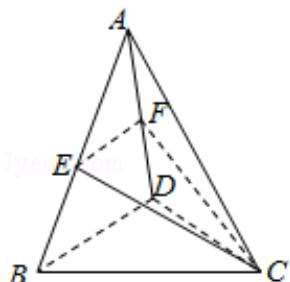

> [!faq]- 2014年全国统一高考数学试卷（文科）（大纲版）（含解析版）解析
>
> > [!success]- **【答案】** B
>
> > [!note]- **【分析】**
> > 由 E 为 AB 的中点, 可取 AD 中点 F, 连接 EF, 则 $\angle CEF$ 为异面直线 CE 与 BD 所成角, 设出正四面体的棱长, 求出 $\triangle CEF$ 的三边长, 然后利用余弦定理求解异面直线 CE 与 BD 所成角的余弦值.
>
> > [!note]- **【解析】**
> > 解：如图，
> >
> > 取 AD 中点 F，连接 EF，CF，
> >
> > ∵E 为 AB 的中点，
> >
> > ∴EF∥DB,
> >
> > 则 $\angle CEF$ 为异面直线BD与CE所成的角，
> >
> > ∵ABCD为正四面体，E，F分别为AB，AD的中点，
> >
> > $$
> > \therefore C E = C F.
> > $$
> >
> > 设正四面体的棱长为 2a，
> >
> > 则 EF=a，
> >
> > $$
> > C E = C F = \sqrt {(2 a) ^ {2} - a ^ {2}} = \sqrt {3} a.
> > $$
> >
> > 在 $\triangle$ CEF中，由余弦定理得：
> >
> > $$
> > \cos \angle C E F = \frac {C E ^ {2} + E F ^ {2} - C F ^ {2}}{2 C E \cdot E F} = \frac {a ^ {2}}{2 \times \sqrt {3} a ^ {2}} = \frac {\sqrt {3}}{6}.
> > $$
> >
> > 故选：B.
> >
> > 
> >
> > 【点评】本题考查异面直线及其所成的角，关键是找角，考查了余弦定理的应用，
> >
> > 是中档题.
