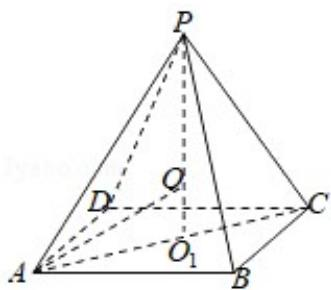

> [!faq]- 2014年全国统一高考数学试卷（文科）（大纲版）（含解析版）解析
>
> > [!success]- **【答案】** A
>
> > [!note]- **【分析】**
> > 正四棱锥 P-ABCD 的外接球的球心在它的高 $PO_{1}$ 上，记为 O，求出
>
> > [!note]- **【解析】**
> > 分析】正四棱锥 P-ABCD 的外接球的球心在它的高 $PO_{1}$ 上，记为 O，求出
> >
> > $PO_{1}$ ， $OO_{1}$ ，解出球的半径，求出球的表面积.
> >
> > 【
> > 解答】解：设球的半径为 R，则
> >
> > ∵棱锥的高为4，底面边长为2，
> >
> > $$
> > \therefore R ^ {2} = (4 - R) ^ {2} + (\sqrt {2}) ^ {2},
> > $$
> >
> > $\therefore R = \frac{9}{4},$
> >
> > ∴球的表面积为 $4\pi\bullet\left(\frac{9}{4}\right)^{2}=\frac{81\pi}{4}$ .
> >
> > 故选：A.
> >
> > 
> >
> > 【点评】本题考查球的表面积，球的内接几何体问题，考查计算能力，是基础题.
