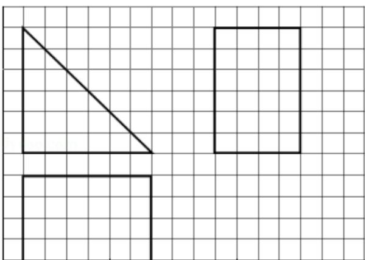
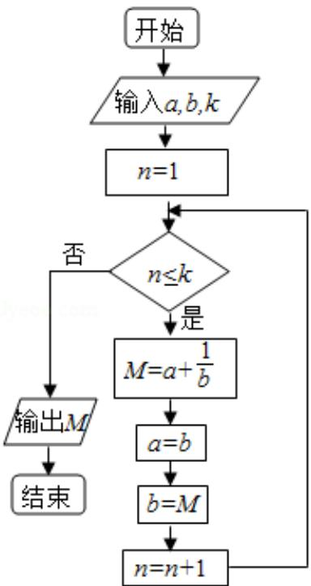

# 2014年全国统一高考数学试卷（文科）（新课标Ⅰ）

项是符合题目要求的

1. （5分）已知集合 $M = \{x \mid -1 < x < 3\}$ ， $N = \{x \mid -2 < x < 1\}$ ，则 $M \cap N = (\quad)$ A. $(-2, 1)$ B. $(-1, 1)$ C. $(1, 3)$ D. $(-2, 3)$

2. （5分）若 $\tan \alpha > 0$ ，则（）
A. $\sin \alpha > 0$ B. $\cos \alpha > 0$ C. $\sin 2\alpha > 0$ D. $\cos 2\alpha > 0$

3. （5分）设 $z = \frac{1}{1 + i} + i$ ，则 $|z| = (\quad)$ A. $\frac{1}{2}$ B. $\frac{\sqrt{2}}{2}$ C. $\frac{\sqrt{3}}{2}$ D. 2

4. （5分）已知双曲线 $\frac{x^2}{a^2} - \frac{y^2}{3} = 1$ （ $a > 0$ ）的离心率为2，则实数 $a = (\quad)$ A. 2 B. $\frac{\sqrt{6}}{2}$ C. $\frac{\sqrt{5}}{2}$ D. 1

5. (5 分) 设函数 $f(x), g(x)$ 的定义域都为 $R$ ，且 $f(x)$ 是奇函数， $g(x)$ 是偶函数，则下列结论正确的是（）

A. $f(x) \cdot g(x)$ 是偶函数

B. $|f(x)| \cdot g(x)$ 是奇函数

C. $f(x) \cdot |g(x)|$ 是奇函数

D. $|f(x) \cdot g(x)|$ 是奇函数

6. (5 分) 设 D, E, F 分别为 $\triangle ABC$ 的三边 BC, CA, AB 的中点, 则 $\overrightarrow{EB} + \overrightarrow{FC} = (\quad)$

A. $\overrightarrow{\mathrm{AD}}$ B. $\frac{1}{2}\overrightarrow{\mathrm{AD}}$ C. $\overrightarrow{\mathrm{BC}}$ D. $\frac{1}{2}\overrightarrow{\mathrm{BC}}$

7. (5 分) 在函数① $y = \cos |2x|$ ，② $y = |\cos x|$ ，③ $y = \cos \left(2x + \frac{\pi}{6}\right)$ ，④ $y = \tan \left(2x - \frac{\pi}{4}\right)$

）中，最小正周期为 $\pi$ 的所有函数为（ ）A. $①②③$ B. $①③④$ C. $②④$ D. $①③$

8. (5 分) 如图, 网格纸的各小格都是正方形, 粗实线画出的是一个几何体的三视
图，则这个几何体是（）

A. 三棱锥 B. 三棱柱 C. 四棱锥 D. 四棱柱

9. (5 分) 执行如图的程序框图, 若输入的 $a, b, k$ 分别为 1, 2, 3, 则输出的 $M = (\quad)$

A. $\frac{20}{3}$ B. $\frac{7}{2}$ C. $\frac{16}{5}$ D. $\frac{15}{8}$

10. (5 分) 已知抛物线 C: $y^{2} = x$ 的焦点为 F, A ( $x_{0}, y_{0}$ ) 是 C 上一点, AF = $\left| \frac{5}{4} x_{0} \right|$ , 则 $x_{0} =$ ( )
A. 1 B. 2 C. 4 D. 8

11.（5分）设 $x, y$ 满足约束条件 $\left\{ \begin{array}{l} x + y \geqslant a \\ x - y \leqslant -1 \end{array} \right.$ 且 $z = x + ay$ 的最小值为7，则 $a = (\quad)$ A. -5    B. 3    C. -5或3    D. 5或-3

12. (5 分) 已知函数 $f(x) = ax^3 - 3x^2 + 1$ ，若 $f(x)$ 存在唯一的零点 $x_0$ ，且 $x_0 > 0$ ，则实数 $a$ 的取值范围是（）

A. (1, +∞) B. (2, +∞) C. (-∞, -1) D. (-∞, -2)

![[高中/真题/按年份分类/2014/2014年全国统一高考数学试卷_文科__新课标ⅰ__含解析版_/填空题/填空题.md]]
![[高中/真题/按年份分类/2014/2014年全国统一高考数学试卷_文科__新课标ⅰ__含解析版_/解答题/解答题.md]]
![[高中/真题/按年份分类/2014/2014年全国统一高考数学试卷_文科__新课标ⅰ__含解析版_/选择题/选择题.md]]
