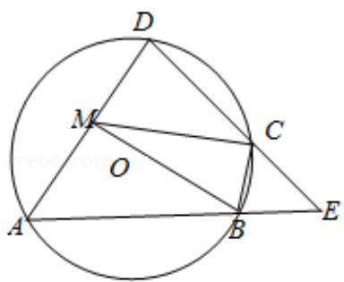

<!-- question-source:start -->
22. (10 分) 如图, 四边形 ABCD 是 $\odot O$ 的内接四边形, AB 的延长线与 DC 的延长线

交于点 E，且 CB=CE.

（Ⅰ）证明： $\angle D=\angle E;$

（II）设 AD 不是 $\odot O$ 的直径，AD 的中点为 M，且 MB=MC，证明： $\triangle ADE$ 为等边三

角形.

## 【选修 4-4：坐标系与参数方程】
<!-- question-source:end -->

![[高中/真题/按年份分类/2014/2014年全国统一高考数学试卷_文科__新课标ⅰ__含解析版_/填空题/题目/answers/Q00027055A1.md]]
